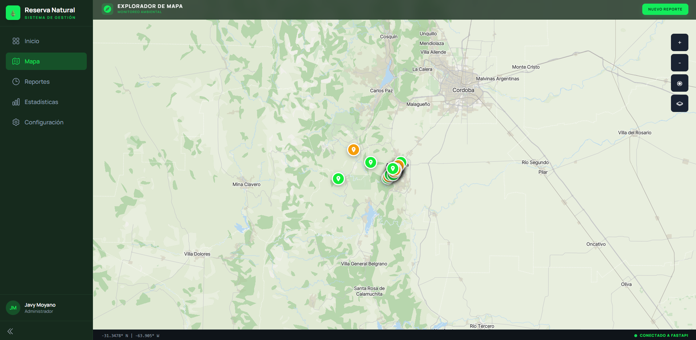
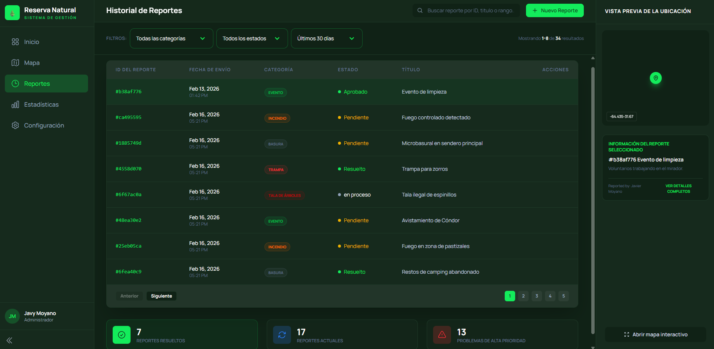
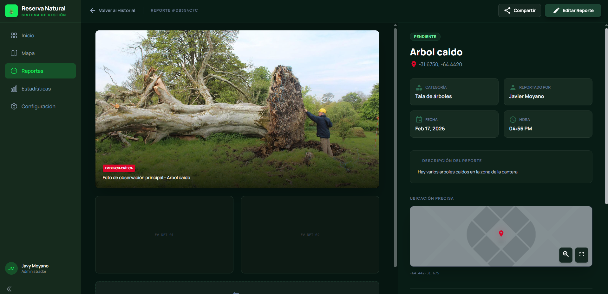
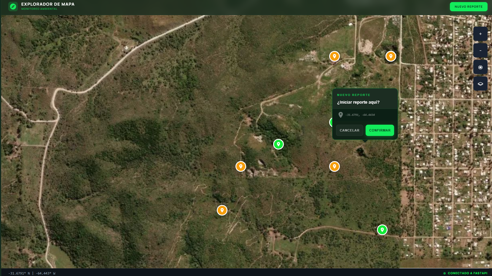
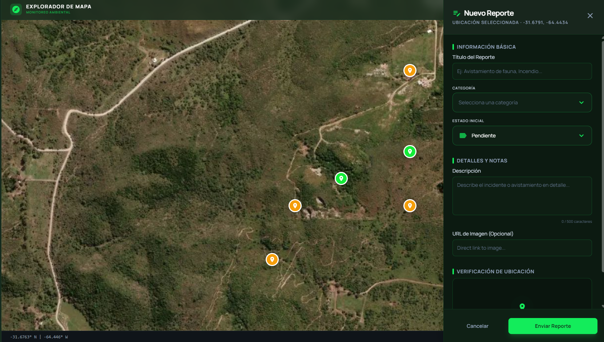

# EcoReport-GIS: Gestión Forestal Inteligente


## 🎉 Demo en Vivo

▶️ **Prueba la aplicación en tiempo real:** https://ecoreport-gis.vercel.app

[](https://ecoreport-gis.vercel.app)

Una experiencia interactiva que permite a los usuarios:
- Visualizar reportes georreferenciados en tiempo real.
- Crear nuevos incidentes usando el GPS del móvil.
- Analizar estadísticas de salud del ecosistema.

---

**EcoReport-GIS** es una solución profesional georreferenciada para el monitoreo de recursos naturales. Diseñada bajo una estética premium de alto contraste, permite la detección temprana de incidentes, la gestión de reportes multimedia y el análisis estadístico de la salud de la reserva.

---

## 📸 Galería del Sistema

| 🛰️ Explorador de Mapa | 📊 Historial de Reportes |
| :---: | :---: |
|  |  |
| *Visualización georreferenciada con capas satelitales.* | *Gestión centralizada con filtros avanzados.* |

| 📝 Detalle de Incidente | 📍 Interacción en Mapa | ➕ Formulario de Ingreso |
| :---: | :---: | :---: |
|  |  |  |
| *Análisis de evidencia y estados.* | *Context menu para creación rápida.* | *Panel lateral con selectores inteligentes.* |

---

## 🔥 Características Técnicas Primordiales

### 🛰️ Inteligencia Geoespacial (GIS)
*   **Motor Cartográfico**: Implementación de MapLibre GL JS con capas personalizadas de MapTiler.
*   **PostGIS Integration**: Consultas espaciales nativas para determinar la ubicación exacta de los incidentes.
*   **Contextual Popups**: Interacción avanzada mediante clic derecho (context menu) para geolocalización precisa de nuevos hallazgos.

### 🎨 Diseño Premium con UX Centrado
*   **Stitch Design System**: Interfaz coherente de modo oscuro con acentos en verde neón (`#13ec5b`) para máxima visibilidad en tablets y móviles.
*   **Custom Selectors**: Componentes de selección desarrollados a medida con iconografía dinámica y estados animados.
*   **Success Feedback**: Sistema de modales de éxito y validaciones en tiempo real para asegurar la integridad del dato.

### ⚙️ Arquitectura de Backend
*   **FastAPI Core**: Gestión asíncrona de reportes y categorías.
*   **Validación con Pydantic**: Modelado estricto de datos para evitar inconsistencias en la base de datos.
*   **Seguridad RLS (Supabase)**: Políticas de seguridad a nivel de fila que permiten operaciones seguras directamente en la API.

---

## 🛠️ Stack Tecnológico

*   **Frontend**: React (Vite), Tailwind CSS, Material Icons.
*   **Backend**: Python 3.10+, FastAPI, SQLAlchemy.
*   **Infraestructura**: Supabase (PostgreSQL + PostGIS).
*   **Servicios**: MapTiler API para estilos de mapa vectoriales y satelitales.

---

## 🚀 Instalación y Despliegue

### Requisitos
*   Node.js 18+
*   Python 3.8+
*   Variables de entorno: `VITE_SUPABASE_URL`, `VITE_SUPABASE_ANON_KEY`, `MAPTILER_KEY`.

### Pasos Rápidos
1.  **Frontend**: 
    ```bash
    npm install
    npm run dev
    ```
2.  **Backend**:
    ```bash
    cd backend
    pip install -r requirements.txt
    uvicorn main:app --reload --port 8001
    ```

---

## 📊 Estructura de la Base de Datos
El proyecto utiliza una extensión geográfica para PostgreSQL (`PostGIS`):

```sql
-- Ejemplo de la tabla principal
CREATE TABLE reportes (
  id uuid DEFAULT uuid_generate_v4() PRIMARY KEY,
  titulo text NOT NULL,
  description text,
  ubicacion geometry(Point, 4326), -- Almacenamiento espacial
  estado text DEFAULT 'pendiente',
  categoria_id uuid REFERENCES categorias(id)
);
```

---

## 🛡️ Seguridad
Se han implementado políticas **RLS (Row Level Security)** en Supabase para permitir:
*   Lectura pública de reportes para visualización en mapa.
*   Inserción y actualización controlada para usuarios registrados y anónimos (según configuración).

---
*Desarrollado para la protección y preservación consciente del medio ambiente.*
